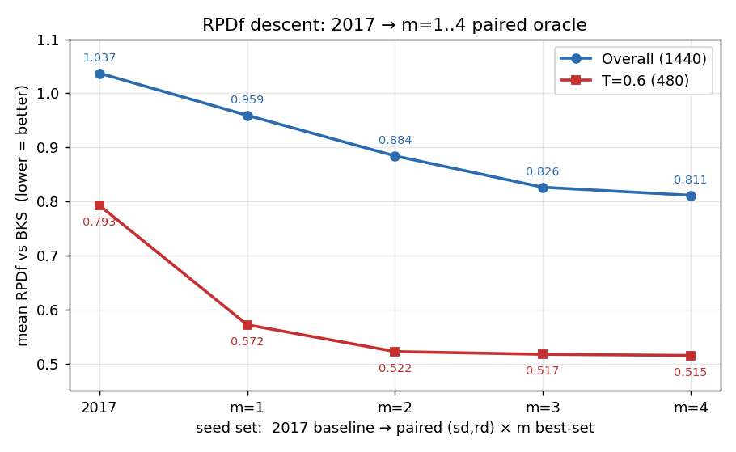

# Dispatch initialization 근거 분석 v3: wxd3–wxd7 확장 포함 paired sweep

> 선행: v1 `analysis/20260624_dispatch_init_justification_1.md`
>       (plan `plans/experiment/20260624/dispatch_init_paper_justification_analysis.md`),
>       v2 `plans/experiment/20260624/dispatch_init_paired_direction_analysis.md`
> rule 레퍼런스: `vault/dispatching.md`
> 작성일: 2026-06-26

## 0. 한 줄 요약 (v2 대비 무엇이 바뀌나)

v2 sweep 은 11개(이후 16개) priority 만 포함했고 **`wxd3`–`wxd7` 이 빠져
있었다.** 본 문서는 그 5개 rule 을 동일 1440 instance·동일 paired 프로토콜
(`sd`/`rd` 양방향, per-instance oracle-best)로 추가 실행해 v2 비교표에 합친
것이다. 새 실험은 **wxd3–7 × {sd,rd} = 10 scenario** 뿐이고, 나머지는 v2 의
재실행본을 그대로 재사용한다.

**결론 미리보기**
- `wxd5 ≈ wxd2` (사실상 동률, `d̄` floor 가 거의 binding 하지 않음) → **중복**.
- `wxd3`, `wxd4` 는 wxd 계열 최약 — 어떤 best-set 에도 등장하지 않음 → **탈락**.
- `wxd6` 은 단독 평균은 wxd2 보다 약간 나쁘지만 **m≥3 paired oracle 에서
  wxd2 를 근소하게 대체**(상호보완).
- `wxd7` 은 전체 평균은 약하나 **oracle-complementary**(m=4 에서 obj 첫 15만↓)
  이고, **tight T=0.6 480개 subset 에서는 단독 1위**(§6) — 버리면 안 됨.

---

## 핵심 결과: RPDf 평균 추이 (2017 → m=4)

> 이 문제는 **최소화**다. 아래 표/그래프의 모든 수치는 **mean RPDf (BKS 대비
> 상대편차, 낮을수록 좋음)** 의 절대값이다 — 2017 baseline 에서 시작해 paired
> (sd,rd)×m best-set 으로 갈수록 **값이 내려가면(=짧아지면) 개선**이다.
> (표는 절대값으로만 본다. 본문 prose 에 가끔 나오는 `+X%` 는 2017 대비
> objective **감소율 = 개선폭**이며, 값이 커지는 게 아니라 줄어드는 양이다.)

| seed set | Overall (1440) | T=0.6 (480) |
|---|---:|---:|
| 2017 baseline `(sd)×{edd,lsl,osl}` | 1.0372 | 0.7927 |
| paired m=1 best | 0.9593 | 0.5720 |
| paired m=2 best | 0.8843 | 0.5225 |
| paired m=3 best | 0.8263 | 0.5174 |
| paired m=4 best | 0.8114 | 0.5153 |



- **Overall**: 1.037 → 0.811 (m=4). 가장 큰 낙폭은 m=1·2 (knee), 이후 평탄.
- **T=0.6 (tight)**: 0.793 → **0.572 (m=1 한 방에 급락)** → 0.515. tight 영역은
  단일 best rule(`wxd7`) 하나만으로도 RPDf 가 27% 떨어진다(§6).
- 각 m 의 best-set 구성은 §3(overall)·§6.2(T=0.6) 표 참조.

---

## 1. 입력 데이터 / 재현

| 항목 | 값 |
|---|---|
| base run (16 priority × {sd,rd} = 32) | `output/20260624/20260626T005929_054803` |
| wxd3–7 run (5 priority × {sd,rd} = 10) | `output/20260624/wxd37_20260626T010953_153930` |
| 합본 long-format CSV | `analysis/20260625/dispatch_init_v3_merged_rpdf_comparison.csv` |
| instance | PRA2017/large 1440개 (n∈{50,100,150,200}), 결측 0, dup 0 |
| scenario | 42 = 21 priority × {sd,rd}, 60,480 행 |
| metric | `obj`=`bestObj` (weighted E+T, 절대), `rpdf`=`RPDf_BKS_data` (scale-free) |
| oracle | per-instance best (paired: 각 priority 의 sd·rd 두 열 모두에서 min) |
| baseline | **2017** = `(sd)×{edd,lsl,osl}`, obj 평균 202,248 / rpdf 1.0372 |
| draw_gantt | **false** (전 scenario) |

**충실도 확인.** base run 으로 v1 채택안(k=5 자유부분집합 `rd_edd,rd_wxd2,
sd_due2_weight_pos,sd_w1,sd_wxd2`)을 재채점 → 2017 대비 **+38,848 (+19.21%)**,
n별 16.8/19.0/19.1/19.7% 로 커밋된 v1 plan 문서 수치와 **정확히 일치**.
다른 서버에서 돈 원본 run 의 신뢰 가능한 대체본임.

> 재현:
> ```bash
> M=analysis/20260625/dispatch_init_v3_merged_rpdf_comparison.csv
> uv run python scripts/analyze_dispatch_sweep.py $M --metric obj  --unit priority --combo-size 1 2 3 4
> uv run python scripts/analyze_dispatch_sweep.py $M --metric rpdf --unit priority --combo-size 1 2 3 4
> ```

---

## 2. wxd 계열 단독 성능 (mean over 1440, 방향별 + paired best)

낮을수록 좋음. `★` = wxd 계열 내 1위. **`best` 열 = instance마다 sd·rd 중 더 좋은
쪽을 골라(paired oracle) 평균** — 즉 그 priority 를 양방향 디코드했을 때의 실제
seed 성능. (`best ≤ min(sd,rd) 평균` 이 일반적 — 방향이 instance 별로 갈리므로.)

| priority | obj sd | obj rd | **obj best** | rpdf sd | rpdf rd | **rpdf best** | 메모 |
|---|---:|---:|---:|---:|---:|---:|---|
| **wxd2** | **182,172** ★ | 184,129 | **175,814** ★ | 0.9913 | 1.0041 | 0.9600 | v2 paired-best single |
| **wxd5** | 182,460 | 184,110 | 176,133 | **0.9904** ★ | 1.0037 | **0.9593** ★ | wxd2 + `d̄` floor → 사실상 동률 |
| wxd1 | 184,411 | 186,374 | 178,049 | 1.0010 | 1.0142 | 0.9703 | |
| wxd6 | 188,005 | 189,096 | 181,896 | 1.0073 | 1.0236 | 0.9834 | two-center 그룹정렬 |
| wxd7 | 196,611 | 197,264 | 190,317 | 1.0661 | 1.0850 | 1.0462 | two-center 변형, **전체 단독 약함**(tight 반전, §6) |
| wxd4 | 202,607 | 201,857 | 194,716 | 1.0883 | 1.1001 | 1.0610 | gated penalty, baseline center |
| wxd3 | 207,034 | 206,262 | 199,401 | 1.0987 | 1.1092 | 1.0721 | gated penalty, `d̄` center — 최약 |

관찰:
- **paired best 가 sd/rd 단독보다 항상 낮다** — 예 wxd2 obj 단독 best 182,172
  → paired 175,814 (−3.5%). 방향이 instance 별로 갈려 양방향 oracle 이 이득.
- **wxd5 와 wxd2 는 obj·rpdf·best 모두 0.2% 이내**. wxd5 의 `max(d̄, 완료추정)`
  floor 가 dense 분포에서 거의 발동하지 않아 wxd2 와 같은 순열을 냄 → 정보 중복.
- **wxd3/wxd4 의 gated `max(·,0)` penalty 는 wxd2 의 affine surrogate 보다 명확히
  열등** (vault §4 "곱셈형이 gated penalty 를 이긴다" 의 실증). 두 rule 모두
  paired best 가 2017 baseline(rpdf 1.0372)보다도 나쁘거나 비슷.
- 방향 효과는 wxd 전 계열에서 **±1% 내외로 작음** (wxd3/4 만 rd 가 근소 우위).

---

## 3. paired oracle: (sd,rd) × m — best priority-set (wxd3–7 포함 후)

각 priority 를 sd·rd 둘 다 디코드 후 instance별 best. 굵게 = wxd3–7 신규 진입.

### 3.1 obj (mean weighted E+T) — obj-최적 best-set

> 모두 절대값(낮을수록 좋음). 맨 위 `baseline` = 2017 init, 맨 아래 `BKS` =
> best-known(도달 가능 하한, RPDf 정의상 mean rpdf=0). best-set 은 instance별
> obj 최소 schedule 을 고른 oracle 이며, mean rpdf 는 그 같은 schedule 의 RPDf.

| m | best-set | mean obj | mean rpdf |
|:--:|---|---:|---:|
| **baseline** | 2017 `(sd)×{edd,lsl,osl}` | 202,248 | 1.0372 |
| 1 | `wxd2` | 175,814 | 0.9600 |
| 2 | `wspt_twt + wxd2` | 158,794 | 0.8878 |
| 3 | `due2_weight_pos + wspt_twt + **wxd6**` | **152,712** | 0.8379 |
| 4 | `due2_weight_pos + wspt_twt + **wxd6 + wxd7**` | **149,874** | 0.8306 |
| **BKS** | best-known solution | 79,030 | 0.0000 |

### 3.2 rpdf (RPDf vs BKS) — rpdf-최적 best-set

> 열 순서 = mean rpdf → mean obj (rpdf 우선). best-set 은 instance별 RPDf 최소
> schedule oracle, mean obj 는 그 schedule 의 절대 obj.

| m | best-set | mean rpdf | mean obj |
|:--:|---|---:|---:|
| **baseline** | 2017 `(sd)×{edd,lsl,osl}` | 1.0372 | 202,248 |
| 1 | `**wxd5**` | 0.9593 | 176,202 |
| 2 | `edd + wspt_twt` | 0.8843 | 165,782 |
| 3 | `edd + wspt_twt + wxd2` | 0.8263 | 153,262 |
| 4 | `edd + wspt_twt + wxd1 + **wxd6**` | 0.8114 | 150,536 |
| **BKS** | best-known solution | 0.0000 | 79,030 |

관찰:
- **m=1·2 는 wxd3–7 추가로도 불변** — wxd5 가 rpdf 단독 1위를 wxd2 에게서
  소수점 4자리로 빼앗을 뿐(0.9593 vs 0.9600), obj 는 여전히 wxd2.
- **wxd6 이 m=3 obj 와 m=4 rpdf 에서 wxd2 를 대체**. 다만 이득은 m=3 에서
  mean obj 152,942(wxd2)→152,712(wxd6) 로 미미.
- **wxd7 은 m=4 obj 에서만 진입** — 단독 약하지만 다른 rule 이 못 잡는 instance
  를 보완해 mean obj 152,241(v2 m4)→149,874 로 내림. 단, init 디코드 8회(2m) 비용.

---

## 4. 방향 기여 (ablation, 채택 P\*={wxd2, wspt_twt, wxd7}, m=3)

| arm | mean obj | mean rpdf |
|---|---:|---:|
| **baseline** 2017 | 202,248 | 1.0372 |
| C-full (sd, rd) | 155,687 | 0.8788 |
| C-sd only | 160,820 | 0.9089 |
| C-rd only | 161,525 | 0.9150 |
| **BKS** | 79,030 | 0.0000 |

두 번째 방향의 한계 이득(C-full vs 단방향) ≈ obj 5k·rpdf 0.03 로 v2 결론과 동일
— 방향은 보완적이되 priority 선택만큼 지배적이지 않음.

---

## 5. 채택 권고

> **채택 P\* = {wxd2, wspt_twt, wxd7}** — 두 regime 의 best pair 합집합.
> `wxd2 + wspt_twt` 는 **전체 obj 기반**(overall m=2 best, 158,794),
> `wspt_twt + wxd7` 는 **T=0.6 tight 기반**(tight m=2 best, 283,090). 공유 축
> `wspt_twt` 중심 union → 전체 **155,687 / 0.8788**, tight **280,713 / 0.5174**
> 로 두 regime 모두에서 각 pair 단독보다 우월(§6.3).

| rule | 판정 | 근거 |
|---|---|---|
| `wxd2` | **채택(코어)** | 단독·paired 모두 최강, 안정. P* 의 전체-obj 축. |
| `wspt_twt` | **채택(공유축)** | 혼잡 영역 지체총량 최소화. 두 pair 의 공통 rule. |
| `wxd7` | **채택** | **tight T=0.6 영역 단독 1위**(§6, +22.89% vs wxd2 +11.57%) + 전체 m=4 보완. |
| `wxd5` | **드롭(중복)** | wxd2 와 0.2% 이내 동률, 새 정보 없음. |
| `wxd6` | **선택적(미채택)** | overall m=3 obj-oracle 최적이나, regime 커버리지 위해 wxd7 선택. pool 확장 시 후보. |
| `wxd3`,`wxd4` | **드롭** | wxd 계열 최약, 어떤 best-set 에도 미진입. |

- **knee 는 여전히 m=2~3.** m=1→2 가 가장 크고, m=3 에서 소폭, m=4 는 미미.
- **채택 P\* `{wxd2, wspt_twt, wxd7}`**: 2017 대비 전체 **obj −23.0%
  (202,248→155,687), rpdf −15.3%**, 동시에 tight T=0.6 에서도 m=3 oracle 최적
  (280,713/0.5174). 순수 obj-oracle 최적집합 `{due2,wspt,wxd6}`(152,712)보다 전체
  obj 약 3k 높지만 tight 미스스펙을 제거(§6.3)하는 대가로 채택.
- **단일 rule 을 하나만 고른다면 여전히 `wxd2`** (rpdf 만 보면 wxd5 와 무승부).

## 6. T=0.6 (tight) subset 비교 — 480 instance

전체 1440 중 **T=0.6 (납기 빡빡, 대부분 job 이 지체)** 480개(n별 120개)만 추린
비교. vault §3 의 "`wspt_twt` 는 tight+narrow(T=0.6) 영역에서 single-machine
최적을 복원한다" 주장과, two-center rule `wxd7` 의 설계 동기를 직접 검증한다.

> 필터: `--t 0.6`. baseline(2017) 도 동일 subset 으로 재계산 →
> obj 379,049 / rpdf 0.7927 (전체 subset 평균이 커서 전체-run 보다 절대값 큼).

### 6.1 단독 평균 (480 inst, T=0.6) — **순위 역전**

`obj/rpdf best` = instance별 sd·rd 중 좋은 쪽 평균(paired oracle), §2 와 동일 정의.

| priority | obj sd | obj rd | **obj best** | **rpdf best** | 전체-run 대비 |
|---|---:|---:|---:|---:|---|
| **wxd7** | **298,047** ★ | 307,026 | **292,288** ★ | **0.5720** ★ | 전체 최약 → **tight 최강** |
| **wspt_twt** | 319,851 | 322,615 | 314,111 | 0.5794 | 전체 하위 → **tight 2위** |
| wxd6 | 341,369 | 347,783 | 333,350 | 0.6881 | |
| wxd2 | 342,665 | 352,243 | 335,185 | 0.7002 | 전체 1위 → tight 4위로 하락 |
| wxd5 | 343,521 | 352,148 | 336,165 | 0.6983 | (≈wxd2) |
| wxd1 | 346,975 | 355,976 | 339,118 | 0.7122 | |

전체 run 에서 거의 꼴찌였던 `wxd7`·`wspt_twt` 가 tight 영역에서 1·2위로 뒤집힌다.
대부분 job 이 지체되는 혼잡 구간에서는 earliness 분배(wxd2 의 강점)보다 **지체
총량 최소화(WSPT, two-center 의 late-group 압축)** 가 지배적이기 때문.

### 6.2 paired oracle (sd,rd)×m, T=0.6

| m | best-set (obj) | mean obj | best-set (rpdf) | mean rpdf |
|:--:|---|---:|---|---:|
| **baseline** | 2017 `(sd)×{edd,lsl,osl}` | 379,049 | 2017 동일 | 0.7927 |
| 1 | `wxd7` | 292,288 | `wxd7` | 0.5720 |
| 2 | `wspt_twt + wxd7` | 283,090 | `wspt_twt + wxd7` | 0.5225 |
| 3 | `wspt_twt + wxd2 + wxd7` | 280,713 | `wspt_twt + wxd2 + wxd7` | 0.5174 |
| 4 | `wspt_twt + wxd2 + wxd6 + wxd7` | 280,133 | `wspt_twt + wxd2 + wxd6 + wxd7` | 0.5153 |
| **BKS** | best-known solution | 160,000 | best-known solution | 0.0000 |

- **m=1 단독에서 wxd7(+22.89%) 이 wxd2(+11.57%) 의 거의 2배 이득.**
- obj·rpdf 가 **m 전 구간에서 동일 best-set** 으로 합치 — tight 영역 신호가 강함.
- `wxd7` 은 m=1~4 **모든** best-set 에 등장(전체 run 에서는 m=4 에서만 등장).

### 6.3 regime별 best pair vs 채택 union P\* (mis-specification 회피)

| seed set | overall obj | overall rpdf | T=0.6 obj | T=0.6 rpdf |
|---|---:|---:|---:|---:|
| `{wxd2, wspt_twt}` — 전체 obj pair | 158,794 | 0.8878 | 289,436 | 0.5384 |
| `{wspt_twt, wxd7}` — T=0.6 pair | 179,543 | 0.9888 | 283,090 | 0.5225 |
| **`{wxd2, wspt_twt, wxd7}` — 채택 union P\*** | **155,687** | **0.8788** | **280,713** | **0.5174** |

전체 obj pair `{wxd2, wspt_twt}` 는 overall(158,794)은 좋지만 tight(289,436)는
평범하고, T=0.6 pair `{wspt_twt, wxd7}` 는 그 반대(tight 283,090 / overall
179,543)다. 두 pair 의 **union `{wxd2, wspt_twt, wxd7}` 은 두 regime 모두에서 각
pair 단독보다 우월**(overall 155,687, tight 280,713) — oracle 후보가 늘수록
instance 별 best 가 좋아지기 때문. 한 regime 에만 맞춘 집합은 다른 regime 에서
손해(mis-specification)지만, **공유 축 `wspt_twt` 중심 union P\* 가 그 비용을
제거**한다.

### 6.4 함의

- `wxd7` 과 `wspt_twt` 는 **전체 평균에서 약하다는 이유로 버리면 안 된다** —
  설계 동기였던 tight(T=0.6) 영역에서 명확히 지배적이며, 채택 P\*에 두 rule 이
  모두 포함된 직접 근거다(§5).
- 향후 **region-aware seeding**(instance 의 T 를 보고 seed priority 를 전환)
  여지를 시사. 단 본 branch 범위 밖 — 별도 검토 대상(YAGNI).

## 7. 한계 / 주의

- obj 는 size-dominated → 절대 이득은 n별 분해와 함께(본문 표 §3.1 기준 n별
  gain 은 23.98~25.7% 로 전 구간 일관).
- oracle = "그 set 을 모두 돌려 best" 전제 → ship 시 priority 수 m 만큼 ×2(paired)
  디코드. wxd6/wxd7 추가 시 init 8회/instance.
- wxd3–7 run 은 base run 과 **별도 프로세스**지만 동일 코드·instance·BKS 테이블
  을 써 병합 시 (insIndex, scenarioName) 중복 0 으로 검증됨(§1).
