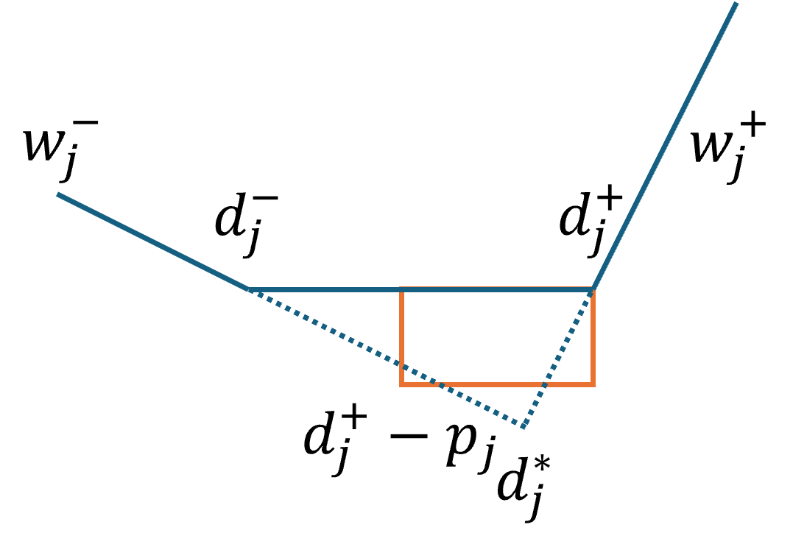

# Algorithm Changes Review: 2026-04-22 ~ 2026-04-28

**지표**: mean RPDf = (bestObj − BKS) / ((bestObj + BKS) / 2), 전체 1440 인스턴스 평균, 낮을수록 우수. 분모가 대칭이라 BKS=0 도 정의됨 (bestObj>0이면 RPDf=2, 둘 다 0이면 0).
**RUN 상세** 및 config·commit 정보는 `20260428_weekly_experiments.md` 참조.

---

## Glossary

- wET: Total weighted earliness and tardiness
- mean time%: instance별 (elapsedTime / timelimit) 을 먼저 계산 후 instance 간 산술 평균. 전체 1440 인스턴스. 1.0 미만이면 timelimit 도달 전 종료(CP-SAT 수렴 또는 dispatch 자연 종료).
- mean bestObj: 평균 bestObj (`AlgRecord.obj_value` = 외부 wET). 전체 1440 인스턴스.

---

## 1. MCF-LB 단독 (기준선)

MCF min-cost flow로 lower bound를 구하고, 이를 objective bound로 사용하는 phase 4-only 구성.
Profile-fix 없이 MCF LB 값을 그대로 보고.

| RUN | mean time% | mean RPDf | mean bestObj |
|---|---|---|---|
| 1 (파라미터 정리 후) | 0.045 | 0.6836 | 156,263 |
| 5 (재확인) | 0.045 | 0.6810 | 156,081 |

---

## 2. BN2D Cmax 디스패처 초기화 시도 → 포기

BN2D 알고리즘(makespan 최소화 dispatcher)으로 초기 스케줄을 생성하고, 그 결과를 CP-SAT hint로 넘기는 구성.

| RUN | 설정 | mean time% | mean RPDf | mean bestObj |
|---|---|---|---|---|
| 2 | Cmax init + PF1+NS | 0.004 | 1.2657 | 348,267 |
| 3 | 동일 (내부 비교 기준 makespan으로 정정) | 0.005 | 1.3112 | 377,392 |
| 4 | v2 config 재시작 | 0.004 | 1.2761 | 353,004 |

**판단**: Cmax 최소화 dispatch가 wET 목적과 상충. 기준선(~0.68) 대비 두 배 가까이 열위. BN2D 라인 포기.

---

## 3. NEH-CP 점진형 생성자 도입

job을 배치 단위로 순서에 따라 추가하고, 배치마다 CP-SAT를 풀어 점진적으로 완성 스케줄을 구성하는 생성자.

| 버전 | 주요 추가 요소 | mean time% | mean RPDf (best scenario) | mean bestObj |
|---|---|---|---|---|
| RUN 6 (기본) | batch=5, PF1, skip_pf_below_makespan | 0.221 | 0.5355 | 152,325 |
| RUN 7 (dispatch hint) | dispatched schedule을 CP hint로 투입, cml/idv variant | 0.221 | 0.3897 | 143,019 |

RUN 6→7 개선의 핵심: dispatch 결과를 CP-SAT hint로 넘김으로써 탐색 시작점 품질 향상.

---

## 4. 설계 공간 스윕: PF / sort priority / opt mode / batch (RUN 8)

16 시나리오 full-factorial: batch∈{5,10} × opt∈{single,lex} × sort∈{due, due*} × PF∈{PF1,PF2}.

### 4-0. 전체 시나리오 (16개, mean RPDf 오름차순)

| batch | opt | sort | PF | mean time% | mean RPDf | mean bestObj |
|---|---|---|---|---|---|---|
| 10 | single | dplus | PF1 | 0.154 | 0.3443 | 135,793 |
| 10 | lex | dplus | PF1 | 0.168 | 0.3444 | 136,092 |
| 5 | lex | dplus | PF1 | 0.182 | 0.3855 | 150,138 |
| 5 | single | dplus | PF1 | 0.158 | 0.3906 | 151,412 |
| 10 | lex | dstar | PF1 | 0.161 | 0.4263 | 145,052 |
| 10 | single | dstar | PF1 | 0.148 | 0.4275 | 145,892 |
| 10 | lex | dplus | PF2 | 0.204 | 0.4638 | 163,087 |
| 5 | lex | dstar | PF1 | 0.175 | 0.4704 | 159,907 |
| 5 | single | dstar | PF1 | 0.151 | 0.4774 | 160,038 |
| 10 | single | dplus | PF2 | 0.157 | 0.4846 | 165,045 |
| 5 | lex | dplus | PF2 | 0.221 | 0.4990 | 173,933 |
| 5 | single | dplus | PF2 | 0.161 | 0.5189 | 175,069 |
| 10 | lex | dstar | PF2 | 0.198 | 0.5510 | 174,445 |
| 10 | single | dstar | PF2 | 0.151 | 0.5653 | 174,753 |
| 5 | lex | dstar | PF2 | 0.216 | 0.5904 | 185,120 |
| 5 | single | dstar | PF2 | 0.154 | 0.6035 | 186,132 |

이하 4-1 ~ 4-4는 동일 데이터의 axis-pivot. mean time% / mean bestObj 는 위 표 참조.

- 목적식: single vs. lex
  - single: batch마다 0.024nc timelimit을 wET objective NEH-CP total timelimit으로 사용
  - lex: batch마다 0.024nc timelimit을 wET objective NEH-CP total timelimit으로 사용 -> 0.006nc timelimit을 makespan objective NEH-CP (wET objective value less than or equal to 조건 걸고) total timelimit으로 사용
- 정렬기준: dplus vs. dstar
  - dplus: 첫 기준으로 max(0, d⁺ − p_last) 오름차순 사용
  - dstar: 첫 기준으로 d\* = (w^{-}_j \* d^{-}_j + w^{+}_j \* d^{+}_j) / (w^{-}_j + w^{+}_j) 오름차순 사용
    
- Profile fix: PF1 vs. PF2
  - PF1: 동일 machine 배치 job 인접 operation간 end-start precedence constraint 추가
  - PF2: 동일 machine 배치 job 하나 건너뛴 operation간 end-start precedence constraint 추가

### 4-1. Profile Fix: PF1 vs PF2

| opt | sort | PF1 | PF2 | Δ |
|---|---|---|---|---|
| single | dplus | 0.3443 | 0.4846 | +0.140 |
| single | dstar | 0.4275 | 0.5653 | +0.138 |
| lex | dplus | 0.3444 | 0.4638 | +0.119 |
| lex | dstar | 0.4263 | 0.5510 | +0.125 |

**결론**: PF2가 모든 조합에서 현저히 열위. PF1로 고정.

### 4-2. Sort priority: due-weight-pos (dplus) vs due\*-weight-pos (dstar)

`dplus`: max(0, d⁺ − p_last) asc 기준 정렬. `dstar`: d* (EDD 변형) 기준 정렬.

| batch | opt | dplus (PF1) | dstar (PF1) | Δ |
|---|---|---|---|---|
| 10 | single | 0.3443 | 0.4275 | +0.083 |
| 10 | lex | 0.3444 | 0.4263 | +0.082 |
| 5 | single | 0.3906 | 0.4774 | +0.087 |

**결론**: dplus가 일관되게 우위. dstar 포기.

### 4-3. Optimization mode: single vs lex

| batch | sort | single | lex | Δ |
|---|---|---|---|---|
| 10 | dplus | 0.3443 | 0.3444 | +0.000 |
| 10 | dstar | 0.4275 | 0.4263 | −0.001 |
| 5 | dplus | 0.3906 | 0.3855 | −0.005 |

**결론**: single과 lex 간 차이 미미. 단순한 single 유지.

### 4-4. Batch size: 5 vs 10

| opt | sort | batch=5 (PF1) | batch=10 (PF1) | Δ |
|---|---|---|---|---|
| single | dplus | 0.3906 | 0.3443 | −0.046 |
| single | dstar | 0.4774 | 0.4275 | −0.050 |
| lex | dplus | 0.3855 | 0.3444 | −0.041 |

**결론**: batch 10이 batch 5 대비 일관되게 우위. 배치를 키울수록 각 CP 풀이가 더 넓은 컨텍스트를 확보.

---

## 5. cp_tl 설정 오류 정정 효과 (RUN 9 → 10)

NEH-CP의 배치당 CP time limit 비율: 의도는 `cp_tl / c / batch_size = 0.024`.

| RUN | cp_tl 설정 | 비율 | mean time% | mean RPDf | mean bestObj |
|---|---|---|---|---|---|
| 9 | 0.16c per batch | 0.011 (오설정) | 0.078 | 0.4142 | 143,724 |
| 10 | 0.36c per batch | 0.024 (정정) | 0.166 | 0.3101 | 128,481 |

**Δ = −0.104 RPDf, time% 0.078 → 0.166 (예산 활용도 2배)**. cp_tl 단 하나의 파라미터 오류가 0.10 RPDf 차이를 유발. TL 예산이 NEH-CP 품질의 핵심 제어 변수임을 확인.

---

## 6. Priority 개선: due2-weight-pos 도입 (RUN 13)

기존 `due-weight-pos`의 첫 번째 정렬 키 `max(0, d⁺ − p_last)`를 `max(r_j, d⁺ − p_last)`로 대체.
릴리스 타임(`r_j`)과 due window를 동시에 고려해 실현 가능한 유휴 시간을 반영하는 변형.

| 설정 | mean time% | mean RPDf | mean bestObj |
|---|---|---|---|
| b15, due-weight-pos, PF1 (RUN 10) | 0.166 | 0.3101 | 128,481 |
| b15, due-weight-pos, PF1 (RUN 12) | 0.160 | 0.3231 | 124,763 |
| b20, **due2-weight-pos**, PF1 (RUN 13) | 0.165 | 0.3082 | 125,315 |

**Δ ≈ −0.003~0.017** (RUN마다 다른 조건이 섞여 있어 순수 기여분 분리 어려움).
이후 모든 NEH-CP 실험의 기본 priority로 확정.

---

## 7. linear batch TL mode + `num_batches` 파라미터 (RUN 14)

RUN 14에서 직교한 두 변경을 동시 실험. 모두 `total_timelimit = 0.024nc`, `due2-weight-pos`, `PF1` 공통.

### 7-1. batch TL mode: constant vs linear (`added_batch_size = 20` 고정)

배치마다 동일 TL을 배분(`constant`)할지, 배치 인덱스에 비례 배분(`linear`)할지.
linear는 후반(큰) 배치에 더 많은 TL 할당 → 어려운 후반 배치의 해상도 향상 의도.

| 시나리오 | TL mode | mean time% | mean RPDf | mean bestObj |
|---|---|---|---|---|
| bs20_constant_dplus2_pf1 | constant | 0.159 | 0.3125 | 125,571 |
| bs20_linear_dplus2_pf1 | linear | 0.166 | 0.3105 | 125,064 |

**Δ = −0.0020 RPDf, −507 bestObj**. linear가 소폭 우위, mean time%도 0.159→0.166으로 증가(예산 활용도 ↑).
효과는 작지만 일관된 방향. RUN 16의 `bs20_linear_..._tl024nc`(0.3069)에서도 linear 채택.

### 7-2. 배치 분할 방식: `num_batches` vs `added_batch_size`

- `num_batches=N`: 총 job 수를 N개 배치로 분할 → 배치 크기 = ⌈n/N⌉ (인스턴스마다 가변).
- `added_batch_size=B`: 배치 크기 B 고정 → 배치 수 = ⌈n/B⌉ (인스턴스마다 가변).

모든 시나리오 `batch_tl_mode = constant`.

| 시나리오 | 분할 방식 | mean time% | mean RPDf | mean bestObj |
|---|---|---|---|---|
| nb3_constant_dplus2_pf1 | num_batches=3 | 0.165 | 0.3496 | 125,654 |
| nb4_constant_dplus2_pf1 | num_batches=4 | 0.162 | 0.3344 | 124,446 |
| nb5_constant_dplus2_pf1 | num_batches=5 | 0.159 | 0.3226 | 123,599 |
| nb10_constant_dplus2_pf1 | num_batches=10 | 0.154 | 0.3279 | 127,066 |
| **bs20_constant_dplus2_pf1** (참조) | **added_batch_size=20** | **0.159** | **0.3125** | **125,571** |

**관찰**:

- num_batches 내부 sweep: nb3(0.3496) → nb4(0.3344) → nb5(0.3226) ↘ , 그러나 nb10(0.3279)은 다시 ↗. nb5 부근이 최적.
- nb3은 배치 크기 과대 → 배치당 CP 풀이가 시간 부족(time% 0.165로 높지만 풀이 미수렴). nb10은 배치 단위 컨텍스트 부족.
- **bs20(고정 배치 크기) ≈ Δ −0.010 RPDf vs nb5 최선치**. 모든 nb 시나리오 대비 일관 우위.
- mean bestObj는 nb5(123,599)가 최저로 RPDf 순위와 불일치 — BKS 분포가 인스턴스 크기에 따라 다르므로 정규화 후/전 순위가 어긋날 수 있음. 비교는 RPDf 기준이 우선.

**결론**: 인스턴스 크기에 비례하는 가변 배치 크기(`num_batches`)는 고정 배치 크기(`added_batch_size`) 대비 열위. 이후 실험은 `added_batch_size` 패턴 유지.

---

## 8. total_timelimit TL 스윕 (RUN 16)

`total_timelimit = 0.024nc` 총 예산을 다양한 batch 크기에 고정 배분하는 스윕.
같은 1440 인스턴스에서 NEH-CP batch/TL 조합 5개를 동시에 비교.

| 시나리오 | batch | TL 총예산 | mean time% | mean RPDf | mean bestObj |
|---|---|---|---|---|---|
| bs20_linear_dplus2_pf1_tl010nc | 20 | 0.010nc | 0.073 | 0.4140 | 135,650 |
| bs20_linear_dplus2_pf1_tl020nc | 20 | 0.020nc | 0.140 | 0.3330 | 127,438 |
| bs20_linear_dplus2_pf1_tl024nc | 20 | 0.024nc | 0.166 | 0.3069 | 125,402 |
| bs12+0.04n_dplus2_pf1_tl024nc | 12+0.04n | 0.024nc | 0.165 | 0.3078 | 125,918 |
| **bs15_linear_dplus2_pf1_tl024nc** | **15** | **0.024nc** | **0.166** | **0.3024** | **126,768** |

**TL 임계**: 0.010nc에서 0.4140 (time% 0.073, 예산 미소진)으로 급락. 0.020nc 이상부터 수렴 구간 진입. 최적: 0.024nc, batch=15.

이 스윕이 지금까지 실험 중 **전체 최선 NEH-CP 구성**(mean RPDf **0.3024**)을 확정.

---

## 9. MCF-LB phase2: CP-SAT vs cumulative 휴리스틱 (RUN 16, 17)

MCF min-cost flow 후 phase2(last-stage-only)를 CP-SAT로 풀 것인지, cumulative heuristic으로 대체할 것인지 비교.

| phase2 방식 | 설정 | mean time% | mean RPDf | mean bestObj |
|---|---|---|---|---|
| CP-SAT (asis) | TL unbounded | 0.018 | 1.0017 | 178,168 |
| CP-SAT (cap 0.01nc) | TL cap 적용 | 0.018 | 1.0017 | 178,168 |
| **Heuristic** (P2=0.005nc, P4=0.005nc) | insert heuristic | 0.025 | 0.9937 | 177,421 |
| **Heuristic** (P2=0.010nc, P4=0.005nc) | insert heuristic | 0.038 | 0.9906 | 176,794 |
| **Heuristic** (P2=0.010nc, P4=0.010nc) | insert heuristic | 0.038 | 0.9903 | 176,695 |

heuristic phase2가 CP phase2보다 소폭 우위(Δ ≈ −0.011). 단, MCF-LB 전체가 NEH-CP(~0.30) 대비 현격히 열위(~0.99). MCF-LB 구성 자체의 한계가 명확.

---

## 10. WxD 디스패처: dispatch-only vs NEH-CP init priority (RUN 19, 23)

두 가지 활용 방식 비교:

**(A) dispatch-only** — 주어진 time limit 내 dispatch 결과 그대로 제출.

| 디스패처 | RUN | mean time% | mean RPDf | mean bestObj |
|---|---|---|---|---|
| wxd1 (early/late 가중 키, 옛 wxd3) | 23 | 0.001 | 1.0142 | 186,374 |
| wxd2 (early/late split + window-endpoint scaled key) | 19 | 0.001 | 1.0041 | 184,129 |

dispatch-only는 NEH-CP(~0.30) 대비 압도적으로 열위. 단독 활용은 의미 없음.

**(B) wxd2 priority를 NEH-CP 내부 job ordering으로 사용** (RUN 19)

| priority | mean time% | mean RPDf | mean bestObj | 비교 기준 |
|---|---|---|---|---|
| due2-weight-pos (RUN 16) | 0.165 | 0.3078 | 125,918 | 같은 batch/TL 구성 |
| **wxd2** (RUN 19) | 0.147 | 0.3731 | 127,390 | 같은 batch/TL 구성 |

**Δ = +0.065**. wxd2 키가 NEH-CP job ordering으로 사용될 때 due2-weight-pos 대비 열위.
dispatch 친화적 키가 생성자 내부 정렬에는 부적합함을 시사.

> **주의**: RUN 19의 시나리오 이름이 `neh_cp_bs12_plus_004n_dplus2_pf1`로 표기되어 있으나,
> 실제 config의 `job_priority`는 `wxd2`. 이름과 실제 파라미터 불일치.

---

## 11. NEH-CP에 MPF23 profile-fix 적용 시도 (RUN 21) → 회귀

PF1의 `idx → idx+1` arc에 `idx → idx+2`, `idx → idx+3` arc를 추가한 확장 profile-fix.
이론상 더 유연한 스케줄 수정 가능, 그러나 arc 수 증가로 CP-SAT 풀이 시간 증가.

| profile-fix | RUN | mean time% | mean RPDf | mean bestObj | 비교 기준 |
|---|---|---|---|---|---|
| PF1 | 16 (bs12+0.04n) | 0.165 | 0.3078 | 125,918 | 동일 batch/TL/priority |
| **MPF23** | 21 (bs12+0.04n) | 0.162 | **0.4285** | 145,539 | 동일 batch/TL/priority |

**Δ = +0.121 회귀**. 현재 timelimit=120s 구성에서 MPF23의 arc 탐색 확장이 오히려 시간 초과·품질 저하 유발.
추가 TL 예산 또는 arc 수 조정 없이는 PF1 대비 비실용적.

---

## 12. half_time seed tag (MCF-LB, RUN 22)

preemption-MCF의 초기 job 배치 기준점을 `(시작시간 + 완료시간) / 2`로 설정하는 seed tag.
기존 seed 대비 job이 구간 중앙에 배치되는 경향.

| seed | RUN | mean time% | mean RPDf | mean bestObj |
|---|---|---|---|---|
| 기본 (cp_asis) | 17 | 0.018 | 1.0017 | 178,168 |
| **half_time** (cp_asis) | 22 | 0.018 | 1.0079 | 183,803 |

Δ = +0.0062. 미미한 차이이나 방향은 부정적. 추가 시나리오(4개 계획)는 실제로 실행되지 않아 종합 평가 불가.

---

## 알고리즘 성능 계보

| 구성 | mean time% | 대표 mean RPDf | mean bestObj | 비고 |
|---|---|---|---|---|
| BN2D Cmax init | 0.004 | ~1.27~1.31 | ~360,000 | 최악 — wET와 상충, 포기 |
| MCF-LB 단독 | 0.045 | ~0.682 | 156,172 | 기준선 |
| NEH-CP v0 (b5, PF1) | 0.221 | 0.5355 | 152,325 | 도입 직후 (RUN 6) |
| NEH-CP + dispatch hint | 0.221 | 0.3897 | 143,019 | hint 효과 (RUN 7) |
| NEH-CP sweep 최선 (b10, single, dplus, PF1) | 0.154 | 0.3443 | 135,793 | RUN 8, 스윕 확정 |
| cp_tl 정정 후 (b15, dplus, PF1) | 0.166 | 0.3101 | 128,481 | RUN 10 |
| due2-weight-pos + b20 | 0.165 | 0.3082 | 125,315 | RUN 13 |
| bs15, linear, dplus2, PF1, 0.024nc | 0.166 | **0.3024** | 126,768 | **전체 최선 (RUN 16)** |
| NEH-CP w/ wxd2 priority | 0.147 | 0.3731 | 127,390 | dplus2 대비 회귀 (RUN 19) |
| MPF23 profile-fix | 0.162 | 0.4285 | 145,539 | 현 config에서 회귀 (RUN 21) |
| MCF-LB heuristic phase2 (최선) | 0.038 | 0.9903 | 176,695 | NEH-CP 대비 현격히 열위 (RUN 17) |
| Dispatch-only wxd2 | 0.001 | 1.0041 | 184,129 | 초기화 수단으로만 유효 (RUN 19) |
| Dispatch-only wxd1 | 0.001 | 1.0142 | 186,374 | 초기화 수단으로만 유효 (RUN 23) |

---

## 핵심 발견 및 다음 과제

### 확정된 사실

1. **NEH-CP >> MCF-LB** (0.30 vs 0.99): MCF-LB는 LB 진단용으로만 유효.
2. **PF1 >> PF2**, **dplus/dplus2 >> dstar**: 이후 모든 실험의 고정값.
3. **TL 예산이 품질 결정**: cp_tl 오설정 하나로 0.10 RPDf 차이. tl ≥ 0.020nc부터 수렴, 최적 0.024nc.
4. **dispatch priority ≠ NEH-CP priority**: wxd2가 dispatch-only에서는 wxd1보다 우위이나, NEH-CP job ordering으로는 due2-weight-pos보다 열위.
5. **MPF23**: 현 TL(120s) 하에서 PF1보다 열위. TL 확장 또는 arc 수 조정 필요.

### TODO

- MCF LB solution 기반 NEH-CP
  - Job insertion priority: MCF LB solution상 (end - start) 값이 작은 job 간의 상대적 위치 먼저 결정
  - (/home/hjt/code/ffc_ddw_sum_et/output/20260428/20260428T203134_549317/mcf_lb_only/Instance_50_5_3_0,2_0,2_10_Rep0/1-apply_lb_by_mcf_C_heatmap.html)
